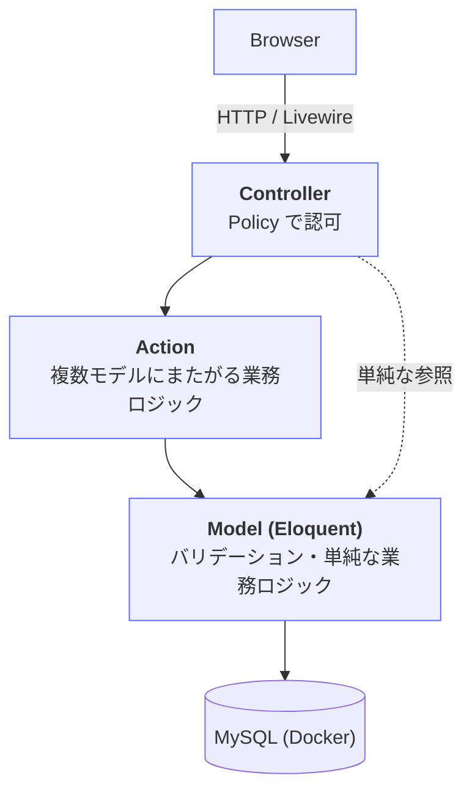
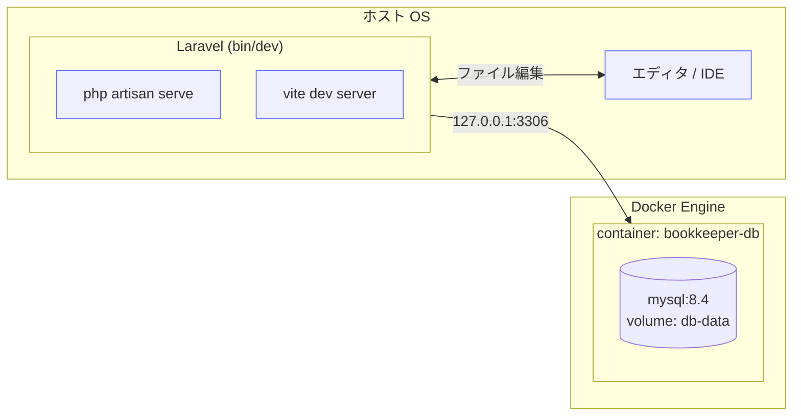

# アーキテクチャ

## レイヤ構成



開発時、MySQL はホスト側ではなく Docker コンテナで稼働する。
Laravel 本体はホスト側で動き、`127.0.0.1:3306` 経由でコンテナの MySQL に接続する。

## 各層の責務

### Controller (`app/Http/Controllers/`)

- HTTP リクエストの受付と Response 返却のみ。
- Form Request（`app/Http/Requests/`）で入力をバリデーション・ホワイトリスト化。
- Policy で認可チェック（`$this->authorize($ability, $model)`）。
- 複雑なロジックは Action に委譲。
- 1 アクション 15 行を目安に収める。

### Action (`app/Actions/`)

- 複数モデルにまたがる業務処理（例: 貸出処理 = 在庫減算 + 貸出記録作成 + 通知）。
- 命名は「操作 + 対象リソース + Action」（例: `RequestLendingAction`）。
- 公開メソッドは `execute` 一つに揃える。
- 結果は明示的な値オブジェクトで返す。`readonly class` で定義する:

  ```php
  final readonly class ActionResult
  {
      public function __construct(
          public bool $success,
          public string $message,
      ) {
      }

      public function successful(): bool
      {
          return $this->success;
      }
  }
  ```

  呼び出し側: `$result = app(RequestLendingAction::class)->execute($user, $book);` → `$result->successful()`

#### 本プロジェクトの Action 一覧

| クラス名 | 責務 |
|---|---|
| `RequestLendingAction` | 借用申請（在庫チェック + Lending 作成） |
| `ApproveLendingAction` | 承認（state 変更 + 在庫減算 + 通知 + 監査ログ、トランザクション内） |
| `ReturnLendingAction` | 返却（state 変更 + 在庫増加） |
| `RejectLendingAction` | 却下（state 変更 + 通知） |

各 Action の副作用の詳細は `@docs/api-spec.md` の「エンドポイント詳細」参照。

### Model (`app/Models/`)

- バリデーションルールの元となる制約定義、リレーション、スコープ、単純な属性ベースのロジック。
- 単一モデルで完結する `isPublished()` のようなメソッドはここに置く。
- Eloquent イベント（`booted()` 内の登録）は最小限。副作用の大きい処理は Action に逃がす。
- `spatie/laravel-query-builder` を使うモデルは、許可するフィルタ・ソートを Controller 側の `QueryBuilder::for(Book::class)->allowedFilters([...])->allowedSorts([...])` で明示する（Model 側に特別な定義は不要）。

### Policy (`app/Policies/`)

- リソースごとに `XxxPolicy` を 1 ファイル。
- `viewAny`, `view`, `create`, `update`, `delete` を定義。
- 一覧の絞り込み（例: 一般ユーザーは自分の貸出のみ閲覧）は Policy ではなく Controller 側で Eloquent スコープを使って表現する（Laravel の Policy には Pundit の `Scope` 相当の仕組みがないため）。例: `LendingsController#index` では `auth()->user()->isAdmin() ? Lending::query() : auth()->user()->lendings()` のように分岐する。
- `Profile` のようにシングルトンリソースを `User` インスタンスとして扱う画面は、Laravel の自動 Policy 解決（クラス名ベース）では通常の `UserPolicy` が使われてしまう。プロフィール編集専用の認可ルールが必要な場合は、Controller で `app(ProfilePolicy::class)->update($request->user(), $targetUser)` のように Policy クラスを直接インスタンス化して呼び出し、自動解決に頼らないことを明示する。

### View (`resources/views/`) / Livewire (`app/Livewire/`)

- Blade。ロジックは Blade コンポーネントか Livewire コンポーネントに逃がす。
- 共通レイアウトは `layouts/app.blade.php`、管理画面用に `layouts/admin.blade.php` を別途用意。
- サーバー往復を伴う動的処理（検索結果の絞り込み、フォームのリアルタイムバリデーション）は Livewire コンポーネントとして実装。
- フォームは Livewire を使わない箇所では通常の Blade `<form>` + `@csrf` を使う。

## URL 設計の方針

- リソースフルなルーティングを基本。
- 管理画面は `/admin/` プレフィックスで `Route::prefix('admin')->name('admin.')` により分離。
- 認証必須エリアは `auth` ミドルウェアで保護。
- 管理画面は `admin` ミドルウェア（`app/Http/Middleware/EnsureUserIsAdmin.php`）で追加保護。

## トランザクション境界

- 「在庫減算 + 貸出記録作成」のように複数テーブルに書き込む処理は必ず `DB::transaction(function () { ... })` で囲む。
- Action クラスの `execute` メソッド内で境界を張る。
- MySQL の InnoDB を使用する前提（`compose.yaml` の MySQL 8.x ではデフォルト）。

## エラーハンドリング

- 業務エラー（在庫不足など）は例外ではなく `ActionResult` で返す。
- 想定外エラーは Laravel の標準例外ハンドラに任せる（カスタム `render()` を散らさない）。
- 404 / 419 / 500 のカスタムエラーページ（`resources/views/errors/`）を用意する。

### 認可エラーの挙動

| エラーの種類 | 挙動 | 実装箇所 |
|---|---|---|
| `Illuminate\Auth\Access\AuthorizationException`（一般認可エラー） | `flash('error')` を表示して `route('home')` へリダイレクト | `bootstrap/app.php` の例外ハンドリング設定（`withExceptions`） |
| 管理者権限不足 | `flash('error')` を表示して `route('home')` へリダイレクト | `app/Http/Middleware/EnsureUserIsAdmin.php` |

フラッシュメッセージの文言（実装ブレ防止のため固定）:

| 発生箇所 | フラッシュメッセージの文言 |
|---|---|
| `AuthorizationException` ハンドリング | `この操作を行う権限がありません。` |
| `EnsureUserIsAdmin` ミドルウェア | `管理者のみアクセスできます。` |

## 非同期処理

本フェーズではバックグラウンドジョブを使わない。

- Breeze のパスワード再発行などのメール送信は **同期送信** で良い。
  development では `MAIL_MAILER=log`（`storage/logs/laravel.log`）で確認する。
- Laravel 標準で選択可能な Queue（database ドライバ）は
  `laravel new` の生成物として残すが、ワーカー（`php artisan queue:work` / `queue:listen`）は起動しない。
- Redis / Laravel Horizon / Reverb などの追加導入もしない。
- 将来「返却期限リマインドメールの定期配信」等を実装することになった時点で
  Queue を有効化する想定。詳細方針は `docs/stack.md` の
  「ジョブ・キャッシュ・ブロードキャスト」セクション参照。

## インフラ構成（開発環境）



- Laravel と DB の間はホストの `127.0.0.1:3306` を経由する（Docker のポートフォワーディング）。
- アプリのソースコードはホスト側にあり、`bin/dev` のファイル監視や IDE 連携をそのまま使える。
- DB のデータは Docker ボリューム `db-data` に永続化される。`docker compose down` してもデータは残る。

## MySQL 固有の注意（実装時）

- `boolean` 型は MySQL では `tinyint(1)` として保存される（Eloquent からは透過的）。
- JSON 型はマイグレーションで `$table->json()` を使う。検索クエリは `->whereJsonContains()` 等の Eloquent メソッドで行う。
- 一意制約付きインデックスのカラム長制限に注意（utf8mb4 では 1 カラム最大 768 文字相当）。
- `ENUM` 型は使わず、PHP のネイティブ Enum（`app/Enums/`）と Eloquent の属性キャストを組み合わせ、DB カラムは integer で保存する。
