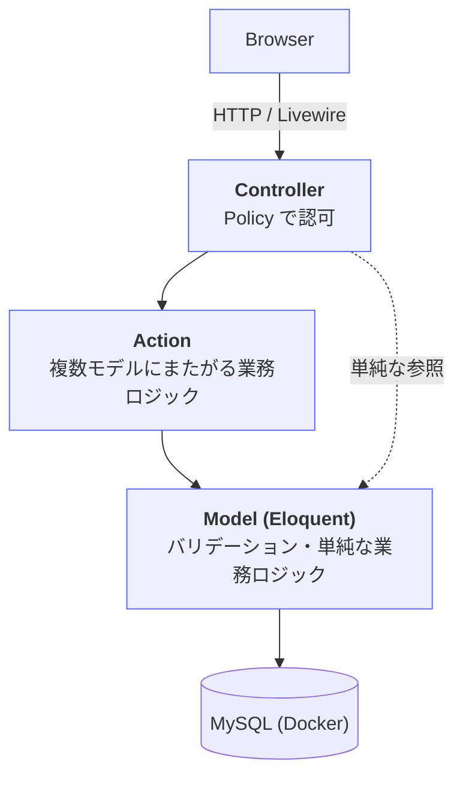
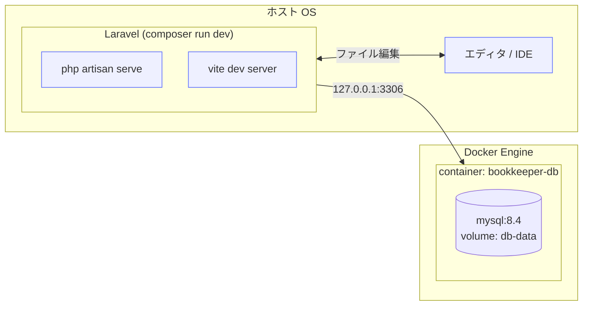

# アーキテクチャ

## レイヤ構成



開発時、MySQL はホスト側ではなく Docker コンテナで稼働する。
Laravel 本体はホスト側で動き、`127.0.0.1:3306` 経由でコンテナの MySQL に接続する。

## 各層の責務

### Controller (`app/Http/Controllers/`)

- HTTP リクエストの受付と Response 返却のみ。
- Form Request（`app/Http/Requests/`）で入力をバリデーション・ホワイトリスト化。
- Policy で認可チェック（`$this->authorize($ability, $model)`）。**ただし `admin`
  ミドルウェアで守られ、対応する Policy を持たないアクションでは呼ばない**
  （`Admin\DashboardController::index()` が該当。単一モデルに紐づかないため
  アビリティを定義できない）。Laravel 11 以降の
  `app/Http/Controllers/Controller.php` は `AuthorizesRequests` トレイトを持たないため、
  基底 Controller に `use Illuminate\Foundation\Auth\Access\AuthorizesRequests;` を
  取り込んでおく（無いと `$this->authorize()` が「未定義メソッド」で落ちる）。
- 複雑なロジックは Action に委譲。
- 1 アクション 15 行を目安に収める。

### Action (`app/Actions/`)

- 複数モデルにまたがる業務処理（例: 貸出処理 = 在庫減算 + 貸出記録作成 + 通知）。
- 命名は「操作 + 対象リソース + Action」（例: `RequestLendingAction`）。
- 公開メソッドは `execute` 一つに揃える。
- 結果は明示的な値オブジェクトで返す。`readonly class` で定義する:

  ```php
  final readonly class ActionResult
  {
      /**
       * $resource は「成功時に呼び出し側がリダイレクト先の組み立てに使うモデル」。
       * 例: POST /lendings は成功後に lendings.show($lending) へリダイレクトするため、
       * 作成した Lending を Action から受け取る必要がある。不要な Action では null。
       */
      public function __construct(
          public bool $success,
          public string $message,
          public ?Model $resource = null,
      ) {}

      public function successful(): bool
      {
          return $this->success;
      }
  }
  ```

  呼び出し側: `$result = app(RequestLendingAction::class)->execute($user, $book);` → `$result->successful()` / `$result->resource`

#### 本プロジェクトの Action 一覧

| クラス名 | 責務 |
|---|---|
| `RequestLendingAction` | 借用申請（在庫チェック + Lending 作成） |
| `ApproveLendingAction` | 承認（state 変更 + **`due_on` 設定（14 日後）** + 在庫減算 + 通知 + 監査ログ、トランザクション内） |
| `ReturnLendingAction` | 返却（state 変更 + 在庫増加） |
| `RejectLendingAction` | 却下（state 変更 + 通知） |

各 Action の副作用の詳細は `@docs/api-spec.md` の「エンドポイント詳細」参照。

> **`audit_logs` へ書き込むのは `ApproveLendingAction` だけ。** Book / Category / Tag /
> User の CRUD では監査ログを書かない。単一モデルの CRUD に Action を作るのは
> 「Action は複数モデルにまたがる業務処理」という上の定義に反し、Controller へ直接書けば
> 「Controller は受付と返却のみ」に反するため、**どちらを選んでも責務分担が崩れる**。
>
> `docs/db-schema.md` が `action` の例に `create` / `update` / `delete` を挙げているのは
> **カラムが取りうる値**の説明であって、現時点でアプリが生成する値ではない。
> `docs/seeds.md` の監査ログ 3 件も Seeder が直接投入するサンプルである。
> CRUD にも記録を広げる場合は Observer による実装が自然だが、`booted()` の
> イベント登録を最小限にする方針との擦り合わせが要るため、**設計変更として別途判断する**。

### Model (`app/Models/`)

- バリデーションルールの元となる制約定義、リレーション、スコープ、単純な属性ベースのロジック。
- 単一モデルで完結する `isPublished()` のようなメソッドはここに置く。
- Eloquent イベント（`booted()` 内の登録）は最小限。副作用の大きい処理は Action に逃がす。
- `spatie/laravel-query-builder` を使うモデルは、許可するフィルタ・ソートを Controller 側の `QueryBuilder::for(Book::class)->allowedFilters(...)->allowedSorts(...)` で明示する（Model 側に特別な定義は不要）。

  > **注意（v7 の引数形式）**: `spatie/laravel-query-builder` v7 の `allowedFilters()` / `allowedSorts()` は**可変長引数のみ**を受け取る（`AllowedFilter|string ...$filters`）。v6 までの配列渡し（`allowedFilters([...])`）は `TypeError` になる。

  > **注意（Eager Load の位置）**: `QueryBuilder` インスタンスに対して `->with()` を繋ぐと、静的解析（larastan）が戻り値を `Eloquent\Builder` と推論し、後続の `allowedFilters()` を「未定義メソッド」と判定する。Eager Load は `for()` に渡すクエリ側で指定する（`QueryBuilder::for(Book::with(['category', 'tags']))`）。

### Policy (`app/Policies/`)

- リソースごとに `XxxPolicy` を 1 ファイル。**作成するのは次の 7 つ**:
  `BookPolicy` / `CategoryPolicy` / `TagPolicy` / `LendingPolicy` / `UserPolicy` /
  `NotificationPolicy` / `AuditLogPolicy`。`NotificationPolicy` は `docs/api-spec.md` の
  「通知の閲覧・既読化は本人のみ」を表現するために要る（`update` で `user_id` の一致を見る）。
- `viewAny`, `view`, `create`, `update`, `delete` を定義。
- 一覧の絞り込み（例: 一般ユーザーは自分の貸出のみ閲覧）は Policy ではなく**クエリ側**で表現する（Laravel の Policy には Pundit の `Scope` 相当の仕組みがないため）。

  > **本プロジェクトは member 用と admin 用を別コントローラに分けているため、
  > 1 つの Controller 内で `isAdmin()` により分岐する形にはならない。**
  > 見える範囲はコントローラごとに固定されている。
  >
  > | クエリの場所 | 範囲 |
  > |---|---|
  > | `LendingController::index()`（member） | 常に `auth()->user()->lendings()` |
  > | `Admin\LendingController::index()`（admin） | `Lending::query()` で全件 |
  > | `BookController::index()`（member） | `where('published', true)` を強制（`docs/screens.md` 参照） |
  > | `Admin\BookController::index()`（admin） | 全件（`published` フィルタが使える） |
- `Profile` のようにシングルトンリソースを `User` インスタンスとして扱う画面は、Laravel の自動 Policy 解決（クラス名ベース）では通常の `UserPolicy` が使われてしまう。プロフィール編集専用の認可ルールが必要な場合は、Controller で `app(ProfilePolicy::class)->update($request->user(), $targetUser)` のように Policy クラスを直接インスタンス化して呼び出し、自動解決に頼らないことを明示する。

  > **ただし本仕様では `ProfilePolicy` を作らない。** `docs/api-spec.md` の `/profile` 系ルートは
  > `{user}` パラメータを持たず、対象は常に `$request->user()` 自身になるため、上記の形で呼んでも
  > **同一インスタンスの比較になり常に true** で、認可として機能しない。`auth` ミドルウェアで
  > 十分である。上の記述は「シングルトンリソースに他人を対象に取りうる操作を足す場合」の
  > 一般則として残している（2026-08-12 のトライアルで、実質無意味な Policy が実装された）。

### View (`resources/views/`) / Livewire (`app/Livewire/`)

- Blade。ロジックは Blade コンポーネントか Livewire コンポーネントに逃がす。
- 共通レイアウトは `layouts/app.blade.php`、管理画面用に `layouts/admin.blade.php` を別途用意。
- サーバー往復を伴う動的処理（検索結果の絞り込み、フォームのリアルタイムバリデーション）は Livewire コンポーネントとして実装。
- **本プロジェクトで新規に書く Livewire コンポーネントはクラスベース（`app/Livewire/`）に揃える。** Breeze が生成する認証画面だけは `livewire/volt` の単一ファイルコンポーネント（`resources/views/livewire/pages/auth/*.blade.php`）である。Breeze の生成物はそのまま使い、Volt 記法を他の画面へ広げない（記法が混在すると読み手がコンポーネントの所在を推測できなくなるため）。
- フォームは Livewire を使わない箇所では通常の Blade `<form>` + `@csrf` を使う。

## URL 設計の方針

- リソースフルなルーティングを基本。
- 管理画面は `/admin/` プレフィックスで `Route::prefix('admin')->name('admin.')` により分離。
- 認証必須エリアは `auth` ミドルウェアで保護。
- 管理画面は `admin` ミドルウェア（`app/Http/Middleware/EnsureUserIsAdmin.php`）で追加保護。

## トランザクション境界

- 「在庫減算 + 貸出記録作成」のように複数テーブルに書き込む処理は必ず `DB::transaction(function () { ... })` で囲む。
- Action クラスの `execute` メソッド内で境界を張る。
- MySQL の InnoDB を使用する前提（`compose.yaml` の MySQL 8.x ではデフォルト）。

## エラーハンドリング

- 業務エラー（在庫不足など）は例外ではなく `ActionResult` で返す。
- 想定外エラーは Laravel の標準例外ハンドラに任せる（カスタム `render()` を散らさない）。
- 404 / 419 / 500 のカスタムエラーページ（`resources/views/errors/`）を用意する。

### 認可エラーの挙動

| エラーの種類 | 挙動 | 実装箇所 |
|---|---|---|
| 認可エラー（`$this->authorize()` の失敗） | `flash('error')` を表示して `route('home')` へリダイレクト | `bootstrap/app.php` の例外ハンドリング設定（`withExceptions`） |
| 管理者権限不足 | `flash('error')` を表示して `route('home')` へリダイレクト | `app/Http/Middleware/EnsureUserIsAdmin.php` |

フラッシュメッセージの文言（実装ブレ防止のため固定）:

| 発生箇所 | フラッシュメッセージの文言 |
|---|---|
| 認可エラーのハンドリング | `この操作を行う権限がありません。` |
| `EnsureUserIsAdmin` ミドルウェア | `管理者のみアクセスできます。` |

> **重要（`withExceptions` に渡す例外型）**: 認可エラーの `render()` コールバックは
> **`Symfony\Component\HttpKernel\Exception\AccessDeniedHttpException` を型に取る**こと。
> `Illuminate\Auth\Access\AuthorizationException` を指定してはならない。Laravel の
> `Handler::render()` は登録済みコールバック（`renderViaCallbacks()`）を呼ぶ**前に**
> `prepareException()` で `AuthorizationException` を `AccessDeniedHttpException` へ
> 変換するため、`AuthorizationException` を指定したコールバックは決して呼ばれず、
> 素の 403 ページが返る。
>
> ```php
> $exceptions->render(function (AccessDeniedHttpException $e, Request $request) {
>     if ($request->expectsJson()) {
>         return null;
>     }
>
>     return redirect()->route('home')->with('error', 'この操作を行う権限がありません。');
> });
> ```

## 非同期処理

本フェーズではバックグラウンドジョブを使わない。

- Breeze のパスワード再発行などのメール送信は **同期送信** で良い。
  development では `MAIL_MAILER=log`（`storage/logs/laravel.log`）で確認する。
- Laravel 標準で選択可能な Queue（database ドライバ）は
  生成物として残すが、ワーカー（`php artisan queue:work` / `queue:listen`）は起動しない。
- Redis / Laravel Horizon / Reverb などの追加導入もしない。
- 将来「返却期限リマインドメールの定期配信」等を実装することになった時点で
  Queue を有効化する想定。詳細方針は `docs/setup.md` の
  「ジョブ・キャッシュ・ブロードキャスト」セクション参照。

## インフラ構成（開発環境）



- Laravel と DB の間はホストの `127.0.0.1:3306` を経由する（Docker のポートフォワーディング）。
- アプリのソースコードはホスト側にあり、`composer run dev`（Vite）のファイル監視や IDE 連携をそのまま使える。
- DB のデータは Docker ボリューム `db-data` に永続化される。`docker compose down` してもデータは残る。

## MySQL 固有の注意（実装時）

`docs/stack.md` の「MySQL 固有の注意（実装時）」セクションを参照（重複記載を避けるため一次情報は stack.md に置く）。
